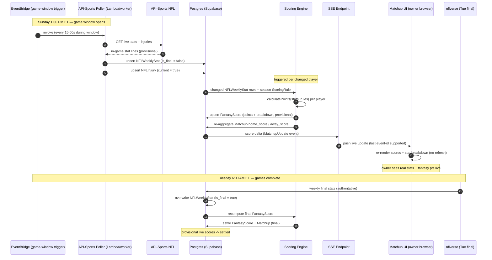
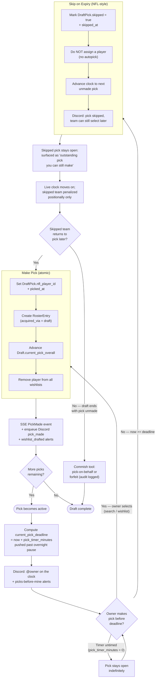

# Dynasty Fantasy Football App — Architecture Spec

**Owner:** Greg
**Audience:** Private league of 10 people
**Status:** Pre-build planning doc — v2 (multi-year + MFL migration)
**Last updated:** 2026-05-25

---

## 1. Overview

A standalone, self-hosted dynasty fantasy football web app replacing the previous MFL-backed approach. The app owns the full league domain model (rosters, drafts, trades, waivers, scoring) and consumes external NFL data for stats and live scoring. **Designed for a multi-decade lifespan** — historical seasons are first-class data, and the existing MFL league history will be imported as a one-time migration.

**Key constraints chosen up front:**

- **Configurable scoring rules** — schema supports arbitrary stat-to-point mappings, per-position bonuses, threshold bonuses. Reusable for future leagues. Rules are versioned per season so changes never corrupt historical scores.
- **Pure dynasty** — no salary cap, no contracts, no dead cap. Players stay on rosters indefinitely until traded, dropped, or retired.
- **Full scope Year 1** — startup draft → regular season + playoffs → rookie draft. (Startup draft skipped if MFL migration provides initial rosters.)
- **Multi-year persistence** — seasons are first-class entities. All historical data (rosters, lineups, matchups, transactions, drafts, standings, championships) is preserved indefinitely. Past seasons become read-only on completion.
- **One-time MFL import** — historical league data migrated from MFL on initial setup. After import, MFL is decommissioned and the app is fully standalone.
- **10 users, private** — auth is simple, scale is trivial.

---

## 2. Tech Stack

| Layer | Choice | Rationale |
|---|---|---|
| Framework | **Next.js 16 (App Router) — current LTS** | My existing stack (previously on 14); Server Components are a strong fit for stat-heavy reads. **Starting on 16, not 14:** Next.js 14 hit End of Life Oct 2025 (no more security patches) and 15's support ends Oct 2026. Since this is greenfield, starting on the current LTS means writing against current APIs once and skipping the painful 14→15→16 migrations entirely. The 15+ caching-default change (fetches no longer force-cached) suits this app's live-data nature — see caching note below. |
| Styling | Tailwind CSS | My stack |
| Language | TypeScript (strict) | My stack |
| Auth | **Supabase Auth + Google OAuth provider** | Supabase is the auth provider; Google is the sign-in method. No password management; 10 users sign in with Google account in one click. Magic-link email fallback available for non-Google users. |
| Database | **Supabase Postgres — Pro tier ($25/mo)** | Pro is required (not Free) — Free pauses after 1 week of inactivity, which is fatal during the off-season; Free has no automated backups, which is unacceptable for multi-decade history. Pro gives 8 GB DB (plenty for stat tables across 20+ years), 100 GB file storage for player headshots, daily backups, 7-day retention. Cheaper and simpler than self-managed RDS once DBA time is factored in. |
| ORM | Prisma | My stack; type-safe queries align with strict TS |
| Validation | Zod | My stack; critical for scoring-rule schema |
| Real-time | SSE (Server-Sent Events) | Sufficient at this scale; no Pusher/Ably needed |
| Hosting | **AWS Amplify** | Hosts the Next.js 16 frontend. I chose it over Vercel Pro on **fit + cost**, not DX. Cost: ~$1–5/mo at 10-user scale (Lambda + CloudFront pennies) vs Vercel Pro's $20/mo per-seat base. Fit: the deciding factor is that this app's hard infrastructure needs (a long-running live-scoring poller, sub-minute jobs) live *outside* the frontend host — and those fit AWS far better than Vercel (see Background jobs). Amplify also matches my existing AWS pattern (Docusaurus already deployed there) and supports GitHub + GitLab. Trade-off accepted: Amplify's setup is less turnkey than Vercel, but the AWS muscle memory is already there. |
| Background jobs | **AWS EventBridge + Lambda** | Runs every scheduled job (nflverse sync, waiver windows, injury sync, lineup-lock checker, backup-swap, draft skip timer, playoff jobs). **Why not Vercel Cron:** (1) Vercel's cron floor is 1 minute — the live-scoring poll, lineup-lock checker, and backup-swap all run every 60s, sitting *exactly* at the floor with zero headroom; EventBridge gives breathing room. (2) Vercel cron is UTC-only with manual conversion — awkward for ET waiver windows + DST; EventBridge schedules are TZ-aware. (3) The live poller is conceptually a long-running worker held alive across a 3-hour game window; Vercel's per-tick serverless invocation model fights that (180 cold-started invocations/window), while Lambda/EventBridge handles it naturally. Cost is fractions of a penny per invocation. **GitHub Actions** remains the home for long one-off jobs (22-season MFL extraction, full historical re-score) that exceed Lambda's 15-min cap; 2000 free private-repo minutes/month is ample. |
| Source control | **GitHub** | Native Amplify integration (and where the GitHub Actions long-job runners live). Better personal-project ecosystem than GitLab; keep GitLab for work projects. Repo structure: `apps/web` (Next.js), `apps/jobs` (Lambda handlers), `apps/mfl-importer` (one-time tool), `packages/db` (Prisma schema), `packages/scoring` (engine). Monorepo via pnpm workspaces. Private repo. |
| Player headshots | **API-Sports hosted headshot URLs (primary) + nflverse fallback** | API-Sports returns a hosted headshot URL per player, eliminating most of the mirror work. For players missing a photo (older/retired) fall back to nflverse `headshot_url`; an optional nightly mirror to Supabase Storage covers URL rot for historical players. Generic position-silhouette placeholder if all sources miss. |
| Notifications | **Discord webhook (channel-scoped)** | Draft pick alerts and backup-swap notices posted to a specific league Discord channel via incoming webhook. Free, no per-message cost. Resend remains available for email fallback if ever needed. No SMS — keeps cost at $0 for notifications. |
| Testing | Playwright | My stack |
| Live NFL data (in-season) | **API-Sports NFL (API-American-Football) — Ultra $25/mo** | Single source for the three live needs: live scoring (refreshes ~every 15s), a dedicated injuries endpoint, and hosted player headshot URLs. Replaces the brittle ESPN hidden API with a documented, supported API. Ultra tier = 75,000 req/day, far beyond a 10-team league's needs even polling every 15s on game days. Free tier (100/day) fine for dev. |
| Historical + weekly-final stats | **nflverse** (free) | The only viable source for 2004–present stat-level box scores — essential for the MFL historical re-score (§18.4). Also the cheapest source for Tuesday-morning weekly-final stats. Relegated from live duty (it's batch-processed hourly/daily on GitHub) to what it's actually best at: deep historical + final stats. |
| MFL migration | One-time TypeScript ETL script, MFL JSON API export, dry-run + commit phases | Leverages my existing MFL API experience; no ongoing MFL dependency post-import |

**Total monthly cost estimate: ~$52–$56/month → ~$5.20–$5.60 per owner (split across 10)**
- Supabase Pro: $25/mo (fixed)
- API-Sports NFL (Ultra): $25/mo (live scoring + injuries + photos)
- AWS Amplify + EventBridge + Lambda: ~$1–5/mo (hosting + jobs at 10-user scale)
- Domain: ~$1/mo amortized
- Notifications (Discord), GitHub (private repo + Actions free tier), nflverse (historical/final stats): $0

The live-data API ($25/mo) is the one cost I'd consider variable: it could drop to API-Sports' free tier (100 req/day) in the off-season or for a low-traffic year, and scale back up for the season. Even at full price the per-owner split is ~$5.50/mo. A Vercel Pro path would add another ~$1.50/owner on top; the live-scoring fit (above) is why hosting stays on AWS regardless. Supabase Free + Vercel Hobby would be $0 but loses backups, pauses off-season, and caps the project at one daily cron (no live scoring) — disqualifying for a multi-decade league.

**Next.js 16 caching posture (important for live data):**

Next.js 15+ flipped the App Router caching defaults — `fetch()` is **no longer force-cached by default**, and the implicit Route Cache is far less aggressive. For this app that's the *correct* default, but be deliberate:

- **Live pages** (matchup detail during games, live playoff leaderboard, draft room): mark `export const dynamic = 'force-dynamic'` or use `noStore()` / `cacheLife('seconds')` so scores reflect the latest `NFLWeeklyStat`/`FantasyScore` writes. SSE pushes the real-time deltas; the initial server render must not be stale.
- **Historical pages** (archived seasons, all-time records, head-to-head): these are immutable once a season is `archived` — cache them aggressively (`force-cache` / long `revalidate`) since 22 years of history never changes. This is where the new opt-in caching model shines: cache exactly the pages that are truly static and leave the live ones dynamic.
- **Mutations** (lineup set, trade accept, waiver submit, pick made): call `revalidatePath()` / `revalidateTag()` after the write so dependent reads refresh.
- Async request APIs (`cookies()`, `headers()`, `params`, `searchParams`) are awaited in 15+ — write them async from day one.

---

## 3. System Architecture

```
┌─────────────────────────────────────────────────────────────┐
│                   Next.js 16 App Router                      │
│  ┌────────────┐  ┌──────────────┐  ┌────────────────────┐  │
│  │   Pages    │  │ Server Comps │  │  Route Handlers    │  │
│  └────────────┘  └──────────────┘  └────────────────────┘  │
└─────────────────────────────────────────────────────────────┘
           │                  │                  │
           ▼                  ▼                  ▼
    ┌─────────────────────────────────────────────────┐
    │            Application Services                  │
    │  scoring-engine | draft-service | trade-service  │
    │  waiver-service | roster-service | ingest        │
    └─────────────────────────────────────────────────┘
           │                  │                  │
           ▼                  ▼                  ▼
    ┌─────────────┐   ┌─────────────┐   ┌──────────────┐
    │  Postgres   │   │  Supabase   │   │  External    │
    │  (Prisma)   │   │   Auth      │   │  NFL APIs    │
    └─────────────┘   └─────────────┘   └──────────────┘
                                              │
                                              ▼
                            nflverse (final) + API-Sports (live, poll)

    ┌─────────────────────────────────────────────────┐
    │           Background Jobs (cron)                  │
    │  • Player sync (nightly)                         │
    │  • Weekly stats sync (Mon AM after games)        │
    │  • Live scoring poll (Sundays/Mondays/Thursdays) │
    │  • Injury sync (every 4hr in-season)             │
    └─────────────────────────────────────────────────┘
```

---

## 4. Data Model (ERD)

The data model splits into five logical clusters: **identity & league config**, **seasons (temporal scope)**, **NFL data (external truth)**, **fantasy state (league truth)**, **transactions (event log)**, and **historical records (cross-season analytics)**.

### 4.1 Identity & League Config

```
User
├── id (uuid, PK, from Supabase auth)
├── email
├── display_name
└── created_at

League                          -- persists across all seasons; the league IS the league
├── id (uuid, PK)
├── name
├── founded_year (int)          -- e.g., 2018 if the league started then
├── current_season_id (FK → Season, nullable)  -- shortcut to active season
├── default_settings (jsonb)    -- defaults that new seasons inherit
├── status (enum: active | dormant | archived)
└── created_at

LeagueMember                    -- league-level membership; spans seasons
├── id (PK)
├── league_id (FK → League)
├── user_id (FK → User)
├── team_id (FK → Team, nullable until team created)
├── role (enum: owner, commissioner)
├── joined_at
├── left_at (nullable)          -- supports owner turnover across years
└── UNIQUE(league_id, user_id)

Team                            -- persists across seasons; SAME team owned by SAME user
├── id (uuid, PK)                  through the years (unless ownership transferred)
├── league_id (FK → League)
├── owner_user_id (FK → User)
├── current_name                -- current display name
├── current_logo_url (nullable)
├── founded_season_id (FK → Season)
└── created_at

TeamSeasonProfile               -- per-season snapshot of team name/logo (names can change)
├── id (PK)
├── team_id (FK → Team)
├── season_id (FK → Season)
├── division_id (FK → Division, nullable)   -- which division this team played in this season
├── name
├── logo_url (nullable)
└── UNIQUE(team_id, season_id)

Division                        -- league divisions (Alpha/Bravo); persists across seasons
├── id (PK)
├── league_id (FK → League)
├── name                        -- "Alpha", "Bravo"
├── short_code                  -- "A", "B"
├── display_order
├── active (boolean)            -- false if division retired
└── created_at
```

**Division ownership model:** Divisions live at the league level and persist across seasons (a 2004 "Alpha" division is the same Division row as 2026 "Alpha"). Team-to-division assignments happen per season via `TeamSeasonProfile.division_id`. This allows realignments between seasons without losing historical division identity.

**Current league setup:** Two divisions, 5 teams each (per §8.4).

### 4.1b Seasons (Temporal Scope)

```
Season                          -- one row per NFL season this league has played
├── id (uuid, PK)
├── league_id (FK → League)
├── season_year (int)           -- 2018, 2019, ..., 2026, etc.
├── status (enum: setup | drafting | active | playoffs | complete | archived)
├── current_week (int)          -- only meaningful while status=active|playoffs
├── settings (jsonb)            -- per-season overrides (waiver budget, playoff weeks, etc.)
├── started_at, completed_at
├── source (enum: native | mfl_import)  -- how this season's data was created
└── UNIQUE(league_id, season_year)
```

**Lifecycle:** `setup → drafting → active → playoffs → complete → archived`. Once `complete`, the season is read-only by default; commish can re-open temporarily for corrections. `archived` is permanent read-only.

### 4.2 Scoring & Roster Configuration

**Versioned per season** so historical scores remain stable when rules change. New seasons typically copy the prior season's rules and the commish edits from there.

**League is IDP (Individual Defensive Players)** — no team Defense slot. Defensive players are scored individually at three position groups: DL (defensive line), LB (linebackers), DB (defensive backs).

```
ScoringRule
├── id (PK)
├── season_id (FK → Season)     -- scoped to a specific season
├── league_id (FK → League)     -- denormalized for query convenience
├── position (enum: ALL | QB | RB | WR | TE | K | DL | LB | DB)
├── stat_category (enum: see §4.2a below)
├── points_per_unit (decimal)   -- e.g., 0.04 for 1pt per 25 passing yards
├── threshold_value (int, nullable)   -- e.g., 100 for 100-yard bonus
├── threshold_bonus (decimal, nullable)
└── UNIQUE(season_id, position, stat_category)

RosterSlot
├── id (PK)
├── season_id (FK → Season)
├── league_id (FK → League)     -- denormalized
├── slot_type (enum: QB | RB | WR | TE | FLEX | SUPERFLEX | K | DL | LB | DB | IDP_FLEX | BN | IR | TAXI)
├── slot_count (int)
├── eligible_positions (text[]) -- e.g., ['DL','LB','DB'] for IDP_FLEX
└── display_order
```

### 4.2a Stat Categories

The `stat_category` enum needs to support both offensive and IDP scoring. Full list, grouped:

**Passing:** `passing_yards`, `passing_tds`, `passing_interceptions`, `passing_completions`, `passing_attempts`, `passing_2pt`, `passing_sacked`

**Rushing:** `rushing_yards`, `rushing_tds`, `rushing_attempts`, `rushing_2pt`, `fumbles_lost`

**Receiving:** `receiving_yards`, `receiving_tds`, `receptions`, `targets`, `receiving_2pt`

**Kicking:** `fg_made_0_39`, `fg_made_40_49`, `fg_made_50_plus`, `fg_missed`, `xp_made`, `xp_missed`

**IDP — Tackling:** `tackles_solo`, `tackles_assist`, `tackles_for_loss`, `qb_hits`

**IDP — Pass defense:** `sacks` (decimal — half-sacks allowed), `interceptions_def`, `passes_defended`

**IDP — Turnover / Splash:** `fumbles_forced`, `fumbles_recovered`, `defensive_tds`, `safeties`, `blocked_kicks`

**Misc:** `return_yards`, `return_tds`, `two_point_returns`

IDP scoring is position-tiered (DBs earn more per tackle than LBs since they make fewer; DLs earn more per sack since it's their primary role). The `position`-scoped `ScoringRule` row supports this directly. Scoring is fully configurable per season — the same versioning model as offense.

### 4.2b IDP Position Groups

NFL roster positions (as stored in nflverse) map to the three IDP fantasy groups used for slot eligibility and position-tiered scoring rules:

| Fantasy Group | NFL Positions (nflverse) |
|---|---|
| DL | DE, DT, DL |
| LB | OLB, WILL, SLB, MLB |
| DB | CB, S, FS |

`NFLPlayer.position` stores the mapped fantasy group (`DL` / `LB` / `DB`). The raw nflverse position string is preserved in `NFLPlayer.nfl_position` so the mapping can be corrected without data loss if a player's role changes or a position code is reclassified.

### 4.2c Default IDP Scoring Preset (MFL-style)

The scoring rule editor (§10.5) seeds new seasons from this preset, which mirrors the league's historical MFL configuration. All values are editable per season; changes trigger a recompute of all affected `FantasyScore` rows without touching other seasons.

| Stat Category | DL | LB | DB | Notes |
|---|---|---|---|---|
| `tackles_solo` | 1.0 | 1.0 | 1.5 | DBs earn premium — fewer volume opportunities |
| `tackles_assist` | 0.5 | 0.5 | 0.5 | |
| `tackles_for_loss` | 2.0 | 2.0 | 2.0 | |
| `sacks` | 4.0 | 3.0 | 3.0 | DLs earn premium — primary role |
| `qb_hits` | 1.0 | 1.0 | 1.0 | |
| `interceptions_def` | 5.0 | 5.0 | 5.0 | |
| `passes_defended` | 1.0 | 1.0 | 2.0 | DBs earn premium — primary role |
| `fumbles_forced` | 3.0 | 3.0 | 3.0 | |
| `fumbles_recovered` | 2.0 | 2.0 | 2.0 | |
| `defensive_tds` | 6.0 | 6.0 | 6.0 | |
| `safeties` | 2.0 | 2.0 | 2.0 | |
| `blocked_kicks` | 2.0 | 2.0 | 2.0 | |

Half-sacks are stored as `0.5` in `NFLWeeklyStat.stat_value`; the `points_per_unit` multiplier applies proportionally (4.0 pts/sack × 0.5 = 2.0 pts). The "Apply preset" action in the scoring editor includes an **IDP (MFL default)** option that bulk-inserts the table above for all three position groups, which the commish can then fine-tune.

### 4.3 NFL Data (External Truth)

```
NFLPlayer
├── id (uuid, PK)              -- our internal ID
├── gsis_id (text, unique)     -- nflverse primary key (canonical)
├── apisports_id (text, nullable)  -- API-Sports player ID for live scoring + photos
├── mfl_id (text, nullable)    -- ID crosswalk for one-time MFL migration
├── full_name
├── position (enum: QB | RB | WR | TE | K | DL | LB | DB)  -- mapped fantasy group (see §4.2b)
├── nfl_position (text, nullable)  -- raw nflverse position string (DE, DT, OLB, MLB, CB, S, FS, etc.)
├── team (nullable)            -- current NFL team abbreviation
├── status (enum: active | injured | suspended | retired | rookie)
├── rookie_year (int, nullable)  -- critical for rookie draft eligibility
├── birthdate
├── headshot_url (text, nullable)        -- preferred source: mirrored copy in Supabase Storage
├── headshot_source_url (text, nullable) -- original API-Sports/nflverse URL for re-mirror
├── headshot_mirrored_at (timestamp, nullable)
└── updated_at

NFLWeeklyStat
├── id (PK)
├── nfl_player_id (FK → NFLPlayer)
├── season_year (int)
├── week (int)
├── stat_category (enum)
├── stat_value (decimal)
├── is_final (boolean)         -- true once game completes
└── UNIQUE(nfl_player_id, season_year, week, stat_category)

NFLInjury
├── id (PK)
├── nfl_player_id (FK → NFLPlayer)
├── status (enum: questionable | doubtful | out | IR | PUP)
├── description
├── reported_at
└── current (boolean)

NFLGame                         -- NFL game schedule, used for per-player lineup lock
├── id (PK)
├── gsis_game_id (text, unique) -- nflverse's game identifier
├── season_year (int)
├── week (int)
├── kickoff_time (timestamptz)  -- canonical kickoff in UTC; client renders in user TZ
├── away_team (text)            -- NFL team abbreviation (e.g., 'DAL')
├── home_team (text)
├── status (enum: scheduled | in_progress | final | postponed | cancelled)
├── stadium (text, nullable)
├── is_international (boolean)  -- London/Munich/Brazil games for early-morning locks
├── updated_at
└── UNIQUE(season_year, week, home_team)
```

### 4.4 Fantasy State (League Truth)

```
RosterEntry                     -- current, live roster state
├── id (PK)
├── team_id (FK → Team)
├── nfl_player_id (FK → NFLPlayer)
├── slot_type (active/bench/IR/taxi)
├── acquired_at
├── acquired_season_id (FK → Season)   -- which season they joined the team
├── acquired_via (enum: startup_draft | rookie_draft | waiver | trade | free_agent | mfl_import)
└── UNIQUE(team_id, nfl_player_id)     -- a player is on one team at a time

WeeklyRoster                    -- frozen snapshot per team per week per season
├── id (PK)                        (replaces the old Lineup table; captures bench too)
├── season_id (FK → Season)
├── team_id (FK → Team)
├── week (int)
├── nfl_player_id (FK → NFLPlayer)
├── slot_type (text)            -- the slot this player filled this week (QB, FLEX, BN, IR…)
├── is_starter (boolean)
├── locked_at (timestamp, nullable)         -- per-player lock based on their game's kickoff
├── nfl_game_id (FK → NFLGame, nullable)    -- which game determines this player's lock time
├── -- Backup designation (only meaningful for starters) --
├── backup_nfl_player_id (FK → NFLPlayer, nullable)   -- bench player to swap in if trigger fires
├── backup_swap_triggers (text[])           -- e.g., ['OUT','IR'] — injury statuses that trigger swap
├── backup_swap_applied (boolean, default false)
├── backup_swap_applied_at (timestamp, nullable)
├── backup_swap_reason (text, nullable)     -- e.g., "Primary status=OUT at 12:55 ET"
└── UNIQUE(season_id, team_id, week, nfl_player_id)

Matchup
├── id (PK)
├── season_id (FK → Season)     -- season-scoped, not just league-scoped
├── league_id (FK → League)     -- denormalized
├── week (int)
├── home_team_id (FK → Team)
├── away_team_id (FK → Team)
├── home_score (decimal)
├── away_score (decimal)
├── status (enum: scheduled | in_progress | final)
├── is_playoff (boolean)
├── playoff_round (enum: nullable, quarterfinal | semifinal | championship | consolation)
└── UNIQUE(season_id, week, home_team_id)

FantasyScore       -- one per player×week×season (scoring rules are per-season)
├── id (PK)
├── season_id (FK → Season)
├── league_id (FK → League)     -- denormalized
├── nfl_player_id (FK → NFLPlayer)
├── week (int)
├── points (decimal)
├── breakdown (jsonb)           -- {passing_yards: 8.4, passing_tds: 12.0, ...}
├── computed_at
└── UNIQUE(season_id, nfl_player_id, week)

SeasonStanding     -- one row per team per season, recomputed weekly
├── id (PK)
├── season_id (FK → Season)
├── team_id (FK → Team)
├── wins (int)
├── losses (int)
├── ties (int)
├── points_for (decimal)
├── points_against (decimal)
├── division_rank (int, nullable)
├── overall_rank (int)
├── playoff_seed (int, nullable)
├── final_finish (int, nullable)  -- 1st, 2nd, ... after playoffs complete
└── UNIQUE(season_id, team_id)
```

### 4.5 Drafts & Picks

```
Draft
├── id (uuid, PK)
├── season_id (FK → Season)     -- season-scoped
├── league_id (FK → League)     -- denormalized
├── draft_type (enum: startup | rookie)
├── format (enum: snake | linear | auction)
├── status (enum: scheduled | in_progress | complete)
├── current_pick_overall (int)
├── pick_timer_minutes (int)    -- offline draft: time per pick in MINUTES. 0 = no timer (untimed)
├── pause_overnight (boolean)   -- if true, clock doesn't run during the overnight window
├── overnight_start (time)      -- e.g., 00:00 — clock pauses
├── overnight_end (time)        -- e.g., 08:00 — clock resumes
├── overnight_timezone (text)   -- IANA TZ for the pause window
├── current_pick_deadline (timestamptz, nullable)  -- computed when a pick becomes active
├── scheduled_start (timestamp)
├── source (enum: native | mfl_import)
└── started_at, completed_at

DraftPick
├── id (PK)
├── draft_id (FK → Draft)
├── pick_overall (int)         -- 1, 2, 3...
├── round (int)
├── pick_in_round (int)
├── original_team_id (FK → Team)
├── current_team_id (FK → Team)  -- updated when pick is traded
├── nfl_player_id (FK → NFLPlayer, nullable)  -- set when made
├── picked_at (nullable)
├── skipped (boolean, default false)        -- true if timer expired before selection
├── skipped_at (timestamp, nullable)        -- when the clock passed this pick
├── made_after_skip (boolean, default false) -- true if filled after having been skipped
└── UNIQUE(draft_id, pick_overall)

FutureDraftPick    -- picks for drafts that haven't been created yet
├── id (PK)
├── league_id (FK → League)
├── season_year (int)          -- the future year, e.g., 2027
├── draft_type (enum: rookie)
├── round (int)                -- exact slot unknown until next season's order set
├── original_team_id (FK → Team)   -- the team that ORIGINALLY owned this pick
├── current_team_id (FK → Team)    -- the team that owns it NOW (after any trades)
├── acquired_via_trade_id (FK → Trade, nullable)  -- the trade that moved it, if any
├── consumed (boolean)         -- true once converted to DraftPick when draft is created
└── UNIQUE(league_id, season_year, draft_type, round, original_team_id)

DraftWishlist                  -- per-team ranked queue of targeted players (pre-draft & during)
├── id (PK)
├── draft_id (FK → Draft)
├── team_id (FK → Team)
├── nfl_player_id (FK → NFLPlayer)
├── rank (int)                 -- owner's ordering, 1 = top target
├── note (text, nullable)      -- "handcuff for my RB1", etc.
├── removed (boolean)          -- auto-set true when player is drafted by anyone
├── created_at, updated_at
└── UNIQUE(draft_id, team_id, nfl_player_id)

DraftNotificationConfig        -- per-user Discord prefs for draft pick alerts
├── id (PK)
├── user_id (FK → User)
├── league_id (FK → League)
├── notify_on_my_clock (boolean, default true)      -- "you're on the clock"
├── notify_on_pick_made (boolean, default true)     -- any pick is made
├── notify_on_wishlist_drafted (boolean, default true)  -- a wishlisted player was taken
├── notify_picks_before_mine (int, default 2)       -- alert when N picks away
├── discord_user_id (text, nullable)                -- for @mention in the channel post
└── UNIQUE(user_id, league_id)

DraftDiscordConfig             -- league-level Discord webhook config (one per league)
├── id (PK)
├── league_id (FK → League)
├── webhook_url (text)          -- the channel-specific incoming webhook
├── channel_name (text)         -- display only, e.g., "#draft-room"
├── active (boolean)
├── created_at
└── UNIQUE(league_id)

DraftNotificationLog           -- audit of sent notifications (idempotency + debugging)
├── id (PK)
├── draft_id (FK → Draft)
├── draft_pick_id (FK → DraftPick, nullable)
├── user_id (FK → User, nullable)   -- null for channel-wide posts like pick_made
├── event_type (enum: on_clock | pick_made | wishlist_drafted | picks_before_mine)
├── status (enum: sent | failed | skipped)
├── provider_message_id (text, nullable)  -- Discord message ID
├── error (text, nullable)
└── sent_at
```

### 4.6 Transactions (Event Log)

```
Trade
├── id (uuid, PK)
├── season_id (FK → Season)     -- the season the trade occurred in
├── league_id (FK → League)     -- denormalized
├── status (enum: proposed | accepted | rejected | vetoed | expired)
├── proposed_by_team_id (FK → Team)
├── proposed_to_team_id (FK → Team)
├── proposed_at
├── responded_at
├── note (text, nullable)
├── source (enum: native | mfl_import)
└── processes_at (timestamp, nullable)  -- if a trade review window

TradeAsset
├── id (PK)
├── trade_id (FK → Trade)
├── from_team_id (FK → Team)
├── to_team_id (FK → Team)
├── asset_type (enum: player | draft_pick | future_pick | faab)
├── nfl_player_id (FK → NFLPlayer, nullable)
├── draft_pick_id (FK → DraftPick, nullable)
├── future_draft_pick_id (FK → FutureDraftPick, nullable)
└── faab_amount (int, nullable)

WaiverClaim
├── id (PK)
├── season_id (FK → Season)
├── team_id (FK → Team)
├── add_nfl_player_id (FK → NFLPlayer)         -- player to ADD (required)
├── drop_nfl_player_id (FK → NFLPlayer, nullable)  -- player to DROP (optional)
├── waiver_type (enum: faab | rolling)         -- copied from Season.settings at claim time
├── faab_bid (int, nullable)                   -- only for waiver_type=faab
├── priority_at_submit (int, nullable)         -- snapshot of team's WaiverOrder position (rolling)
├── requires_drop (boolean)                    -- true if roster is full and add needs a drop
├── status (enum: pending | won | lost | invalid)
├── invalid_reason (text, nullable)            -- e.g., "roster full, no drop specified"
├── processed_at (nullable)
├── processed_in_window_id (FK → WaiverWindow, nullable)
└── created_at

WaiverOrder                     -- rolling-priority order (one active per season; only used when waiver_type=rolling)
├── id (PK)
├── season_id (FK → Season)
├── set_by_user_id (FK → User)  -- commish who set the initial order
├── set_at (timestamp)
├── active (boolean)
└── UNIQUE(season_id, active) WHERE active = true   -- one active order per season

WaiverOrderEntry                -- a team's current slot in the rolling order
├── id (PK)
├── waiver_order_id (FK → WaiverOrder)
├── team_id (FK → Team)
├── position (int)              -- 1 = next to claim; higher = later. Reorders on each win.
├── last_moved_at (timestamp, nullable)  -- when this team last dropped to the back
└── UNIQUE(waiver_order_id, team_id), UNIQUE(waiver_order_id, position)

WaiverSchedule                  -- configurable per season; defines when waiver windows run
├── id (PK)
├── season_id (FK → Season)
├── day_of_week (enum: monday | tuesday | wednesday | thursday | friday | saturday | sunday)
├── time_of_day (time)          -- e.g., 03:00:00 (3 AM local)
├── timezone (text)             -- IANA TZ, e.g., 'America/New_York'
├── active (boolean)            -- can be toggled off mid-season
├── description (text, nullable)
├── created_at
└── UNIQUE(season_id, day_of_week, time_of_day)

WaiverWindow                    -- actual instances of waiver processing runs
├── id (PK)
├── schedule_id (FK → WaiverSchedule)
├── season_id (FK → Season)
├── scheduled_for (timestamptz) -- the materialized run time
├── status (enum: pending | running | completed | failed | skipped)
├── claim_count (int)
├── started_at (timestamp, nullable)
├── completed_at (timestamp, nullable)
└── UNIQUE(schedule_id, scheduled_for)

Transaction        -- unified audit log, spans all seasons
├── id (PK)
├── season_id (FK → Season)
├── league_id (FK → League)     -- denormalized
├── team_id (FK → Team)
├── type (enum: add | drop | trade | waiver_won | draft_pick | commish_override | mfl_import)
├── nfl_player_id (FK → NFLPlayer, nullable)
├── related_trade_id (FK → Trade, nullable)
├── related_waiver_id (FK → WaiverClaim, nullable)
├── notes (text)
├── source (enum: native | mfl_import)
├── external_id (text, nullable)   -- e.g., MFL transaction ID for idempotency
└── created_at
```

### 4.7 Playoff & Historical Records

The playoff format is **cumulative points across weeks 15–17** (per §8.4), not a head-to-head bracket. Seeding still matters for determining who's eligible.

```
PlayoffSeeding                  -- locked once Week 14 completes
├── id (PK)
├── season_id (FK → Season)
├── seed (int)                  -- 1, 2, 3, 4, 5
├── team_id (FK → Team)
├── selection_reason (enum: division_winner | division_runner_up | wildcard)
├── division_id (FK → Division, nullable)
├── regular_season_record (text)  -- "10-4" for display
├── regular_season_points (decimal) -- tiebreaker
├── locked_at (timestamptz)
└── UNIQUE(season_id, seed)

PlayoffStanding                 -- running totals across weeks 15-17 (recomputed weekly)
├── id (PK)
├── season_id (FK → Season)
├── team_id (FK → Team)
├── playoff_seed (int)
├── week_15_points (decimal, nullable)
├── week_16_points (decimal, nullable)
├── week_17_points (decimal, nullable)
├── total_points (decimal)         -- sum of above; the championship deciding value
├── final_rank (int, nullable)     -- 1st = champion, 2nd = runner-up, 3rd, 4th, 5th
├── computed_at
└── UNIQUE(season_id, team_id)

Championship                    -- one row per completed season
├── id (PK)
├── season_id (FK → Season)
├── league_id (FK → League)     -- denormalized
├── champion_team_id (FK → Team)
├── runner_up_team_id (FK → Team)
├── third_place_team_id (FK → Team, nullable)
├── champion_total_points (decimal)    -- 3-week cumulative
├── runner_up_total_points (decimal)
├── margin_of_victory (decimal)        -- champion - runner_up
└── recorded_at

HeadToHeadRecord                -- all-time matchup history between two teams
├── id (PK)
├── league_id (FK → League)
├── team_a_id (FK → Team)
├── team_b_id (FK → Team)       -- CHECK (team_a_id < team_b_id) for canonical ordering
├── wins_a (int)
├── wins_b (int)
├── ties (int)
├── points_for_a (decimal)
├── points_for_b (decimal)
├── playoff_meetings (int)
├── last_meeting_season_id (FK → Season)
├── computed_at
└── UNIQUE(team_a_id, team_b_id)

LeagueRecord                    -- "best ever" records (highest game score, longest streak, etc.)
├── id (PK)
├── league_id (FK → League)
├── record_type (enum: highest_team_week | lowest_team_week | longest_win_streak |
│                     longest_loss_streak | most_points_season | highest_player_week |
│                     most_championships | biggest_blowout | closest_win |
│                     highest_playoff_total | lowest_playoff_total)
├── team_id (FK, nullable)
├── nfl_player_id (FK, nullable)
├── season_id (FK, nullable)
├── week (int, nullable)
├── value (decimal)             -- the record value (score, streak length, etc.)
├── description (text)
└── computed_at

TeamCareerStats                 -- per-team aggregates across all seasons
├── id (PK)
├── league_id (FK → League)
├── team_id (FK → Team)
├── seasons_played (int)
├── total_wins, total_losses, total_ties (int)
├── total_points_for, total_points_against (decimal)
├── playoff_appearances (int)
├── championships (int)
├── runner_ups (int)
├── third_places (int)
├── best_finish (int)
├── worst_finish (int)
└── computed_at
```

These tables are **derived** — wiped and rebuilt by a recompute job whenever a season completes (or on demand). The source of truth is always `Matchup` + `SeasonStanding` + `Championship`.

---

## 5. Scoring Engine

The single most important service in the app. It's a **pure stateless function**:

```ts
type StatLine = { stat_category: StatCategory; value: number };
type ScoringContext = { league_id: string; rules: ScoringRule[]; position: Position };

function calculatePoints(stats: StatLine[], ctx: ScoringContext): {
  total: number;
  breakdown: Record<string, number>;
}
```

**Lookup precedence** when finding the applicable rule:
1. Exact match: `league × position × stat_category`
2. Fallback: `league × ALL × stat_category`
3. If no rule found → 0 points (silent, not error)

**Bonus logic** (threshold rules):
- If `stat.value >= rule.threshold_value`, add `rule.threshold_bonus` once.
- Multiple thresholds per category supported (100-yard bonus + 150-yard bonus).

**Position determination:**
- Use `NFLPlayer.position` at the time stats were recorded (positions can change mid-career).
- For DEF/IDP, position is team-level not player-level.

**When it runs:**
- After each `NFLWeeklyStat` insert/update, enqueue scoring for that player in every league × season where they were rostered that week.
- Idempotent — running it twice produces the same `FantasyScore` row.
- `breakdown` JSON stored alongside `total` for the matchup detail view.
- The scoring rule lookup uses the `Season.id` of the matchup, not the current season — so historical recomputes use historical rules.

**Why this matters being configurable:**
The whole point of the 3x schema work is that a commissioner can change scoring (e.g., enable TE Premium for the *next* season only) without disturbing historical scores. Rules are season-scoped — a 2018 matchup is forever scored with 2018 rules even if the league adopts TE Premium in 2026.

---

## 6. NFL Data Ingestion

Two sources, two cadences.

### 6.1 nflverse (Post-game truth)

- **What:** Weekly box score stats, player metadata, **NFL schedule with kickoff times**, injury data.
- **When:** Pull Tuesday morning (post all MNF games). Pull Monday morning for short weeks. Schedule data pulled in late summer for new season, then weekly to catch any reschedules/flex moves.
- **How:** Direct fetch of nflverse release artifacts on GitHub (CSV/parquet). No Python required if using a simple HTTPS GET + a parquet reader, but `nfl_data_py` via a small Python service is easier. Alternative: ship as a separate scheduled GitHub Action that writes to the DB.
- **Authoritative for:** `NFLWeeklyStat` (final), `NFLPlayer` roster moves, **`NFLGame` schedule** (used for lineup lock per §8.1), weekly final fantasy scoring.
- **Historical depth:** nflverse data goes back to 1999. This means imported MFL seasons can have their **raw NFL stats** sourced from nflverse and re-scored using the imported league rules — useful when MFL exports only have aggregated fantasy points but stat-level breakdowns are wanted. See §18.4.

### 6.2 API-Sports NFL (Live updates)

- **What:** In-game stat updates, live scores, current game state, **injuries (dedicated endpoint)**, and **hosted player headshot URLs**.
- **When:** Polling during game windows only:
  - Thursday 8 PM – 11:30 PM ET
  - Sunday 1 PM – 11:30 PM ET (with break between window 1 and 4 PM kickoffs)
  - Monday 8 PM – 11:30 PM ET
- **Cadence:** Every 15–60 seconds during active games (API-Sports refreshes ~15s). Adaptive — slow to 5 min if no games active. At Ultra tier (75,000 req/day) even aggressive polling is well within budget.
- **Authoritative for:** In-game `NFLWeeklyStat` rows where `is_final = false`; live `NFLInjury` status on game days; `NFLPlayer.headshot_url`. In-game stats overwritten by nflverse when games go final.
- **Why API-Sports over the ESPN hidden API:** documented + supported (no undocumented-endpoint fragility), covers all three live needs (scores, injuries, photos) in one source, and the injuries endpoint directly feeds the backup-swap automation (§8.1.4). Removed the ESPN hidden API entirely.

### 6.3 ID Crosswalk

Critical early decision. Build the player ID mapping table on Day 1:
- `gsis_id` (nflverse) is canonical
- `apisports_id` (live scoring/photos) and `mfl_id` (one-time migration) are the only other crosswalk columns on `NFLPlayer` — these are the two external systems actually called
- nflverse publishes `ff_playerids` mapping (includes MFL IDs and more) — load it once at setup, refresh nightly, to populate `mfl_id` against the canonical `gsis_id`
- API-Sports IDs are mapped in at player-sync time: match API-Sports players to canonical `gsis_id` by name + team + position, flag any unmatched for manual review in the commish dashboard
- Every external API call goes through a resolver: `getApiSportsIdForPlayer(internalId)`, `getMflIdForPlayer(internalId)`
- The `mfl_id` column is the critical join key for the one-time migration in §18; `apisports_id` is the critical join key for live scoring
- *(ESPN and Sleeper IDs are intentionally not stored — those sources are not used. `ff_playerids` exposes them for free if a future source ever needs them, but storing unresolved IDs is avoided for schema clarity.)*

### 6.4 Recomputation

When scoring rules change OR a stat is corrected, a recompute runs:
- Find every `NFLWeeklyStat` for affected `(season, week)`
- Re-run scoring engine for every player×league×week
- Re-aggregate `Matchup.home_score` / `away_score`
- Make this a callable admin action (commish tool)

---

## 7. Draft System

### 7.1 Draft Model — Offline / Asynchronous

This league drafts **offline** (asynchronous), not in a single live-everyone-present session. Teams come and go; the draft proceeds on a timer with notifications pulling owners back when relevant. This shapes the whole design:

- **No requirement that all 10 owners are online simultaneously.** The draft advances on a per-pick timer; owners get notified when it's their turn (or near it).
- **Persistent state, not ephemeral.** Every pick, wishlist change, and timer event is written to the DB. An owner can close the tab, get a text hours later, open the app, and pick. Server is always the source of truth.
- **SSE for whoever IS watching.** Owners who keep the draft room open get live updates (picks appearing, clock ticking) via SSE, but it's an enhancement, not a requirement. The draft works fine if nobody's watching.
- **Skip-on-expiry (NFL-style), not autopick.** If a pick timer expires, the system does **not** select a player for the team. Instead the pick is **skipped** — the clock passes to the next team, and the skipped team can come back and make its selection at any time (any player still available), without losing the pick. This mirrors how the actual NFL draft operates: a team that runs out of time can be "jumped" by later picks but still owns its selection.

**Pick timer (minutes-based, with overnight pause):**
- `Draft.pick_timer_minutes` sets the time allowed per pick, in **minutes**. Offline drafts use long timers (commonly several hours to a full day) so owners have time to respond to a Discord notification.
- `pick_timer_minutes = 0` means **untimed** — the pick stays open indefinitely until the owner makes it; nothing is ever skipped. Useful for relaxed off-season rookie drafts.
- **Overnight pause:** when `pause_overnight = true`, the clock stops running during the configured window (`overnight_start`–`overnight_end` in `overnight_timezone`, e.g., midnight–8 AM ET). A pick that would otherwise expire at 2 AM instead extends until the window ends plus remaining time. This prevents an owner from being skipped while asleep.
- **Deadline computation:** when a pick becomes active, `current_pick_deadline` is computed as `now() + pick_timer_minutes`, then pushed forward to skip any overnight window it crosses. The timer job (§11) compares `now()` against this deadline rather than recomputing each tick — so deadline math (including DST and the pause window) happens once per pick.

**Skip-on-expiry mechanics (NFL-style):**
- When `now() >= current_pick_deadline`, the timer job marks the current `DraftPick` row `skipped = true`, sets `skipped_at`, and advances the clock to the **next unmade pick** in order.
- The skipped team is **not** assigned a player and keeps the right to make the pick. Its `DraftPick` row stays open (`nfl_player_id = NULL`, `skipped = true`).
- **Catching up:** a skipped team can submit its selection at any later time. When it does, the system fills the skipped `DraftPick` row, clears nothing about subsequent picks (they already happened), and the draft continues from wherever the live clock is.
- **On-the-clock determination:** "current pick" = the earliest `DraftPick` by `pick_overall` that is neither made nor whose team has an even-later active turn. In practice the live clock always sits on the lowest-numbered pick that hasn't been made yet AND isn't currently skipped-and-waiting; skipped picks are surfaced as outstanding picks the affected owner can still make in their draft room.
- **Penalty is positional, not material:** the only cost of being skipped is losing position in the live order (later teams pick ahead, so the player pool shrinks before the skipped team returns). The team never forfeits the pick itself. This matches NFL behavior exactly.
- A Discord post fires on skip: "⏭️ Team X's pick expired and was skipped — they can still select when ready."

### 7.2 Dedicated Draft Room

Route: `/league/[id]/draft/[draftId]` — the owner-facing draft interface.

**Player search & filter.** Available-player pool with:
- **Search by name** (fuzzy match on `NFLPlayer.full_name`).
- **Filter by NFL team** (`NFLPlayer.team`).
- **Filter by position** (QB/RB/WR/TE/K/DL/LB/DB; FLEX/SUPERFLEX/IDP_FLEX groupings).
- Combined filters (e.g., "available WRs on KC").
- Only shows undrafted players (excludes anyone with a `DraftPick.nfl_player_id` set in this draft, and — for rookie drafts — restricts to `rookie_year = season_year`).

**Wishlist management.** Each owner maintains a personal `DraftWishlist`:
- Add any available player to the wishlist with a drag-to-rank ordering.
- Reorder targets; add notes ("handcuff for my RB1").
- When any team drafts a wishlisted player, that row auto-sets `removed = true` and the UI strikes it through (and optionally fires a `wishlist_drafted` notification, §7.4).
- The wishlist is a **personal planning/queue tool** — it speeds up making a pick (one tap from the owner's ranked list) but is never used to auto-select on a team's behalf. If a team's timer expires, the team is skipped (§7.1), not auto-picked from the wishlist.

**Making a pick.** When on the clock, the owner selects a player (from search results or wishlist) and confirms. The pick writes atomically:
- Set `DraftPick.nfl_player_id` and `picked_at`
- Create the `RosterEntry` (acquired_via = startup_draft | rookie_draft)
- Advance `Draft.current_pick_overall`
- Mark the player removed from all teams' wishlists
- Broadcast SSE `PickMade` event + enqueue notifications

**Draft board view** (`/board`): full grid of all picks (round × team), live-updating, shows who's on the clock and time remaining.

### 7.3 Startup vs Rookie Draft

**Startup Draft (one-time):**
- All NFL players draftable.
- Snake or linear (settings choice).
- Skipped if MFL migration provides initial rosters (§12 Phase 2).

**Rookie Draft (annual):**
- Only players with `rookie_year = current_season` draftable.
- Draft order determined by inverse standings (or commish-configured lottery).
- Future picks get materialized into actual `DraftPick` rows when the draft is created (§7.5).
- Same draft room UI as startup with a filtered player pool.

### 7.4 Pick Notifications (Discord)

When a pick is made (or a team is approaching its turn), the notification service posts to the league's Discord channel via a **channel-scoped incoming webhook** (`DraftDiscordConfig.webhook_url`). Per-user toggles in `DraftNotificationConfig` control which events trigger a post and whether the owner gets `@mention`ed.

**Trigger events:**
| Event | Default | Post content |
|---|---|---|
| `on_clock` | on | `@owner` mentioned — "🏈 @Owner you're on the clock! Pick by 8:42 PM." |
| `picks_before_mine` | on (N=2) | `@owner` mentioned — "2 picks until you're up, @Owner." |
| `pick_made` | on | Channel post (no mention) — "Team X drafted Player Y (RB, 1.04)." |
| `wishlist_drafted` | on | `@owner` mentioned — "Heads up @Owner: Player Y (your #3 target) was just drafted." |

**Channel-scoped delivery:**
- One incoming webhook per league, pointed at a specific channel (e.g., `#draft-room`). Configured once in `DraftDiscordConfig`; commish pastes the webhook URL during draft setup.
- Owner-directed events (`on_clock`, `picks_before_mine`, `wishlist_drafted`) include a Discord `@mention` via the owner's `discord_user_id`.
- Channel-wide events (`pick_made`) post without a mention so the channel isn't a wall of pings.
- The webhook is free and requires no bot hosting — Discord's incoming-webhook feature is sufficient for one-way posting. (A bot would only be needed for private DMs, which we're not doing.)

**Delivery guarantees:**
- Every send is logged to `DraftNotificationLog` with the Discord message ID and status.
- Idempotency: before posting, check the log for an existing `sent` row for `(draft_pick_id, user_id, event_type)` — prevents duplicate posts if a job retries.
- Failures are logged with the error and retried up to 3× with backoff.

**Notification worker:** a queue consumer (EventBridge → Lambda, or a small in-process queue) that processes notification jobs enqueued by the pick-made transaction. Decoupled from the pick write so a slow Discord call never blocks the draft.

### 7.5 Pick Trading & Future-Pick Materialization

- Future picks are tradeable from Day 1 — `FutureDraftPick` exists even before the next rookie draft is created (see §8.2 for the trade accounting).
- When commish creates next year's rookie draft, all unconsumed `FutureDraftPick` rows for that year are consumed and converted to `DraftPick` rows with the correct order (derived from inverse standings or lottery), carrying `current_team_id` forward so traded picks land with their new owner.

---

## 8. Roster Operations

### 8.1 Lineup Management

#### 8.1.1 Setting Lineups

- Each `WeeklyRoster` row represents a player's slot assignment for that week (starter or bench).
- Owners can edit lineups any time before a player's individual lock fires.
- Lineup edits update `WeeklyRoster.slot_type` and `is_starter` atomically.
- UI surfaces opponent matchup, projections, injury status, and game time per player.

#### 8.1.2 Per-Player Lineup Lock

- **Lock timing: 5 minutes before the player's NFL game kickoff.**
- Lock is per-player based on `NFLGame.kickoff_time` for the game their team plays that week.
- Resolution: when a player's `WeeklyRoster` row is read or written, derive `lock_time = NFLGame.kickoff_time - 5 minutes`. If `now() >= lock_time`, deny edits to that row.
- Once locked, `WeeklyRoster.locked_at` is set; the row becomes immutable except for the backup-swap automation (§8.1.4).

**NFL schedule reality this handles automatically:**
- **Thursday Night Football** — TNF players lock Thursday ~7:15 PM ET while the rest of the roster stays editable until Sunday.
- **Sunday early games** — 12:55 PM ET lock.
- **Sunday late games** — 3:55 PM ET lock.
- **Sunday Night Football** — ~8:15 PM ET lock.
- **Monday Night Football** — ~8:10 PM ET lock.
- **International games** — London Sunday morning kickoffs (e.g., 9:30 AM ET) lock at 9:25 AM ET. Identified via `NFLGame.is_international`.
- **Bye weeks** — players with no `NFLGame` that week have `nfl_game_id = NULL` on the `WeeklyRoster` row; lock evaluator treats this as "locked at week start with 0 points possible" so owners must move them to bench themselves.
- **Postponed/flex-moved games** — the nflverse schedule sync (§6.1) refreshes weekly to catch reschedules; any change to `NFLGame.kickoff_time` recomputes derived locks.

#### 8.1.3 Backup Designation

For any starter, owners may designate **one backup** from their bench:

- Set `WeeklyRoster.backup_nfl_player_id` to a bench player on the same team.
- Set `WeeklyRoster.backup_swap_triggers` — array of injury statuses that fire the swap. Default: `['OUT', 'IR', 'inactive_gameday']`. Owners can include `['questionable']` if they want aggressive swapping (not recommended — Q usually plays).
- Validation: backup must be eligible for the starter's `slot_type` (e.g., a WR can back up a FLEX slot, but a QB cannot back up an RB slot).
- Backup designation editable until starter's own lock fires.

#### 8.1.4 Automated Backup Swap

A background job ("backup-swap-checker") runs every 60 seconds during pre-game windows:

```
Pseudocode for each upcoming game in next 30 minutes:
  For each WeeklyRoster row where:
      nfl_game_id = this_game
      is_starter = true
      backup_nfl_player_id IS NOT NULL
      backup_swap_applied = false
      locked_at IS NULL
  Do:
      Get current NFLInjury.status for primary player
      If status IN backup_swap_triggers:
          Validate backup is still on roster and uninjured (status != OUT/IR)
          Atomic swap:
              - primary WeeklyRoster row: is_starter=false, slot_type='BN'
              - backup WeeklyRoster row:  is_starter=true,  slot_type=<original starter's slot>
              - primary row: backup_swap_applied=true, backup_swap_applied_at=now(), backup_swap_reason="<status> at <time>"
          Notify owner via SSE / email
      End if
      If now() >= kickoff_time - 5 minutes:
          Set locked_at = now() on both rows
      End if
  End for
End for
```

**Edge cases:**
- If both primary AND backup are OUT at lock time: no swap; owner loses the slot.
- If primary clears their status (Q → Active) before kickoff: no swap; backup remains on bench.
- If primary OUT and backup OUT, then a third player (DEF/etc.) becomes available later: out of scope — only one backup per slot.
- If backup is on bye week (no `NFLGame`): swap still happens but the backup scores 0; surface a warning in UI when owner sets the backup.

### 8.2 Trades

**Multi-asset:** players + current-draft picks + future picks + FAAB. Workflow: proposed → counter-proposable → accepted/rejected, with an optional commish review window (configurable in `Season.settings`).

**Veto policy: commish-only.** Only the commissioner can veto an accepted trade (no league vote, no automated collusion checks). Veto sets `Trade.status = vetoed`, reverses any applied asset moves, and writes a `commish_override` `Transaction` with a reason. The decision to keep veto commish-only avoids the friction and drama of league-vote vetoes in a 10-person friend league.

**On acceptance, run one atomic transaction:**
- Swap rostered players between teams (move `RosterEntry` rows)
- Reassign current-draft picks: update `DraftPick.current_team_id`
- Reassign future picks: update `FutureDraftPick.current_team_id` (see accounting below)
- Move FAAB between team budgets
- Write a `Trade` row, one `TradeAsset` row per asset, and `Transaction` log entries
- Notify both owners via Discord (same notification service as drafts)

**Future-pick accounting — the key dynasty detail.**

A `FutureDraftPick` row models a single tradeable future asset (e.g., "Team A's 2027 1st"). Trading it never deletes or duplicates the row — it only moves ownership:

- `original_team_id` — **immutable.** Always the team whose draft slot this pick represents. This is what makes it "Team A's 2027 1st" forever, even after Team B acquires it. Critical because the pick's eventual draft *position* is derived from the original team's standings.
- `current_team_id` — **mutated on each trade.** The team that currently owns the right to make the pick.
- `acquired_via_trade_id` — points at the `Trade` that most recently moved it, for provenance.

**Querying "picks a team has traded away":**
```sql
-- Future picks Team X originally owned but no longer controls
SELECT * FROM future_draft_pick
WHERE original_team_id = :teamX
  AND current_team_id != :teamX
  AND consumed = false;
```

**Querying "picks a team has acquired":**
```sql
SELECT * FROM future_draft_pick
WHERE current_team_id = :teamX
  AND original_team_id != :teamX
  AND consumed = false;
```

**Team picks page** (`/league/[id]/team/[teamId]/picks`) renders three buckets per future year:
1. **Own picks held** — `original = current = this team`
2. **Acquired picks** — `current = this team, original = someone else` (shows "via Team Y")
3. **Picks traded away** — `original = this team, current = someone else` (shows "to Team Z")

This three-bucket view is the canonical answer to "what does my draft capital look like?" and prevents the common dynasty bug of a team appearing to still own a pick it traded.

**Validation guardrails:**
- A team cannot trade a `FutureDraftPick` where `current_team_id != proposing_team` (a team can't trade a pick it doesn't own).
- A team cannot trade a pick already `consumed = true` (draft already happened).
- Optional: cap how many future years out picks can be traded (`Season.settings.max_future_pick_years`, default 3) — prevents mortgaging-the-future abuse.

**Seeding future picks:** When a season starts, seed one `FutureDraftPick` per team per round for the next N rookie drafts (`original_team_id = current_team_id = team`, `consumed = false`). They become tradeable immediately and get consumed when their draft year's rookie draft is created (§7.5).

### 8.3 Waivers (Configurable Schedule + Two Modes)

**Schedule is configurable per season** via `WaiverSchedule` (§4.6). The current league defaults to **three weekly windows**: Tuesday 10 PM ET, Thursday 7 PM ET, and Sunday 12 PM ET. Commish can add, remove, or toggle individual schedule entries from the admin UI.

**Defaults to seed at season creation:**

| Day | Time (local) | Rationale |
|---|---|---|
| Tuesday | 22:00 ET | Processes the week's main waiver run after Monday-night games and Tuesday roster moves settle |
| Thursday | 19:00 ET | Last pickups before Thursday Night Football locks TNF players (~7:15 PM ET) |
| Sunday | 12:00 ET | Final pre-game pickups (handcuffs, byes, late injury news) before the Sunday 1 PM ET kickoffs lock |

#### 8.3.1 Two Waiver Modes (commish picks per season)

`Season.settings.waiver_type` is either `faab` or `rolling`. The commish chooses it at season setup (admin console, §10.5); it's snapshotted onto each `WaiverClaim.waiver_type` so a mid-season config change never re-interprets already-submitted claims.

**FAAB mode (`faab`):**
- Each team starts with `Season.settings.faab_initial_budget` (default $100).
- Higher bid wins. Tiebreaker chain via `Season.settings.waiver_tiebreakers`, default `['faab_bid', 'rolling_position', 'submission_time']`.
- Winning bid is deducted from the team's budget.

**Rolling-priority mode (`rolling`):**
- Order is set once by the commish at season start (§8.3.2) into a `WaiverOrder` + one `WaiverOrderEntry` per team.
- Lowest `position` wins a contested claim.
- **On winning a claim, the team drops to the back** of the order: its `WaiverOrderEntry.position` is set to max+1 and all teams that were behind it shift up by one. This is the classic "use it and lose it" rolling waiver.
- Teams that don't win keep their position.

#### 8.3.2 Setting the Rolling Order (commish, admin console)

- At season setup the commish sets the initial `WaiverOrder` from `/admin/seasons/[year]/settings` — typically reverse order of the prior season's final standings, or manual, or randomized.
- Creating the order writes one `WaiverOrderEntry` per team with sequential `position` 1..10 and marks the order `active`.
- Logged to `AdminAuditLog` (`action = settings_changed`, target = waiver order).
- The current order is visible to all owners on the waivers page so everyone knows where they stand.

#### 8.3.3 Team Waiver Selection (the claim flow)

A team submits a `TeamWaiverSelection` — surfaced in the UI as a waiver claim — in one of two shapes:

1. **Add only** — `add_nfl_player_id` set, `drop_nfl_player_id` null. Valid only if the team has an open roster spot (see capacity check below).
2. **Add + drop** — both set. The drop frees a spot for the add; processed atomically (the dropped player goes to free agency / waivers, the added player joins the roster).

**Roster-capacity check (runs at submit AND again at processing time):**

```
max_roster = sum(RosterSlot.slot_count) for the season   -- total spots incl. BN/IR/TAXI
current_size = count(RosterEntry) for the team

If add-only:
    if current_size < max_roster  -> claim valid (requires_drop = false)
    else                          -> claim INVALID unless a drop is added
                                     (set status=invalid, invalid_reason="roster full, no drop specified")
If add + drop:
    effective_size = current_size - 1 (the drop)
    if effective_size < max_roster -> valid (requires_drop = true)
    else                            -> invalid (shouldn't happen; drop always frees one)
```

- The check runs **twice**: at submit (immediate UI feedback — "your roster is full, pick a player to drop") and again when the `WaiverWindow` processes (the roster may have changed between submit and processing — e.g., an earlier claim that window already filled the last spot). A claim valid at submit can be re-validated as invalid at processing and marked `lost`/`invalid` with a reason.
- IR/TAXI nuance: players in `IR` or `TAXI` slots may be excluded from the `current_size` count if `Season.settings.ir_taxi_exempt_from_cap = true` (dynasty leagues commonly exempt them). Configurable.

#### 8.3.4 Processing Flow

1. A lightweight cron job ("waiver-window-materializer") runs daily at midnight ET. It reads active `WaiverSchedule` rows for the current season and creates `WaiverWindow` rows for any upcoming window in the next 7 days that doesn't already exist.
2. The waiver processor runs every 5 minutes, finds `WaiverWindow` rows where `scheduled_for <= now()` and `status = pending`, and for each:
   a. Groups pending `WaiverClaim` rows by `add_nfl_player_id` (contested players).
   b. For each contested player, resolves the winner by mode — highest `faab_bid` (FAAB) or lowest `WaiverOrderEntry.position` (rolling).
   c. Re-runs the roster-capacity check on the winner; if now invalid, marks `lost`/`invalid` and moves to the next-best claimant.
   d. Applies the winning claim atomically: drop (if any) → add → write `Transaction` rows (`drop` + `waiver_won`) → deduct FAAB or roll the winner to the back of `WaiverOrder`.
   e. Marks losing claims `lost`.
3. Failed/invalid claims carry a reason; teams can resubmit for the next window.
4. After processing, unclaimed players move to the free-agent pool (first-come-first-served add/drops, still subject to the same capacity check).


### 8.4 Playoff Format

**Format: 5-team, 3-week cumulative-points championship.** No bracket, no head-to-head elimination. The champion is whichever of the 5 playoff teams scores the most total fantasy points across weeks 15, 16, and 17.

#### 8.4.1 Regular Season Structure

- Two divisions of 5 teams each (10 teams total).
- Regular season = weeks 1–14 (14 weeks of head-to-head matchups).
- After Week 14 completes, regular season standings are frozen and playoff seeding is computed.

#### 8.4.2 Playoff Seeding (5 teams)

After Week 14, the **playoff-seeding job** runs and writes `PlayoffSeeding` rows:

| Seed | Selection rule |
|---|---|
| 1 | Best-record division winner |
| 2 | Other division winner |
| 3 | Best-record division runner-up |
| 4 | Other division runner-up |
| 5 | Wildcard — best record among the remaining 6 teams (3rd–5th place in each division) |

**Tiebreakers for seeding (configurable, applied in order):**

Default order via `Season.settings.playoff_tiebreakers`:

1. Head-to-head record between tied teams
2. Division record (intra-divisional wins)
3. Total points for (season)
4. Total points against (season, lower is better — softer schedule signal)
5. Coin flip (manual commish entry)

The tiebreaker order is editable from the commish settings UI any time before Week 14 completes; locked thereafter.

#### 8.4.3 Playoff Weeks (15–17)

- All 5 playoff teams continue playing weekly matchups (against each other in some scheduling pattern, or against non-playoff teams in "consolation" matchups — TBD per §13.7).
- The matchup head-to-head **result is recorded but doesn't determine the champion**. Each team's `Matchup` rows in weeks 15–17 score points normally; those points feed `PlayoffStanding`.
- After each playoff week's scoring settles, the **playoff-standings-update job** recomputes:
  - `PlayoffStanding.week_15_points`, `week_16_points`, `week_17_points` (whichever are available)
  - `PlayoffStanding.total_points` = sum of weeks played so far
  - `PlayoffStanding.final_rank` = rank by `total_points` (only populated after Week 17)
- The 5 non-playoff teams play out a separate "consolation" path (matchups still generated but no championship implications).

#### 8.4.4 Crowning the Champion

After Week 17 final stats settle:

1. Verify all 5 playoff teams have scores for all 3 weeks (rare but handle: postponed/cancelled NFL games).
2. Sort `PlayoffStanding` by `total_points` descending; set `final_rank` 1–5.
3. Write `Championship` row: champion (rank 1), runner-up (rank 2), third-place (rank 3), with `champion_total_points` and `margin_of_victory`.
4. Update `SeasonStanding.final_finish` for all 10 teams (1–5 from playoff path, 6–10 from consolation path).
5. Trigger the historical records rebuild (§4.7 derived tables).
6. Transition season to `complete` status, then `archived` after a configurable hold period.

#### 8.4.5 Edge Cases

- **NFL game cancelled (e.g., 2020 COVID, 2024 Bills/Bengals)**: playoff team gets 0 points for affected players; commish has manual override.
- **Tie in total points after Week 17**: configurable tiebreaker (default: highest single-week playoff score among the tied teams; secondary: regular-season points for).
- **Mid-playoff trade**: trade window typically closes before Week 15; enforce via `Season.settings.trade_deadline_week` (default: end of Week 13).
- **Lineup lock during playoffs**: same per-player rules as regular season (§8.1.2).

---

## 9. Live Scoring Architecture

- SSE endpoint at `/api/leagues/[id]/live` streams `MatchupUpdate` events.
- Client subscribes when viewing matchup detail page on Sundays.
- Server-side: a single background poller (API-Sports, §6.2) writes to `NFLWeeklyStat` and broadcasts changes to all connected SSE clients.
- Reconnection: client passes `last-event-id`, server replays missed events from a short in-memory ring buffer.

**Why not WebSockets / Pusher / Ably:** 10 users, occasional 3-hour windows. SSE is one-way (server → client), simpler, works through proxies, no extra infrastructure.

---

## 10. Routes & Pages

```
/                           Landing / login
/login
/leagues                    User's leagues
/leagues/new                Create league (commish flow)

/league/[id]                League home (current week matchups, standings teaser)
/league/[id]/settings       League config (commish-only edits)
/league/[id]/scoring        Scoring rules editor (commish-only edits)
/league/[id]/roster-slots   Roster config (commish-only edits)
/league/[id]/teams          All teams + owners

/league/[id]/standings      Standings table
/league/[id]/schedule       Full schedule + matchup grid

/league/[id]/matchup/[week]/[matchupId]  Matchup detail (live during games)

/league/[id]/team/[teamId]              Team home (roster overview)
/league/[id]/team/[teamId]/roster       Editable roster (own team only)
/league/[id]/team/[teamId]/lineup/[week]  Set lineup for a week (per-player lock countdown, backup designation)
/league/[id]/team/[teamId]/picks        Draft picks owned (current + future)

/league/[id]/players                    Player pool, search, free agents
/league/[id]/players/[playerId]         Player detail (stats, ownership)

/league/[id]/trades                     Trade hub
/league/[id]/trades/new                 Propose trade
/league/[id]/trades/[tradeId]           Trade detail / accept-reject

/league/[id]/waivers                    Waiver claims (own + processed)

/league/[id]/draft/[draftId]            Draft room (search, wishlist, pick)
/league/[id]/draft/[draftId]/board      Big board view (all picks grid)
/league/[id]/draft/[draftId]/wishlist   Manage personal wishlist (planning/quick-pick queue)
/league/[id]/draft/[draftId]/recap      Post-draft recap
/league/[id]/settings/notifications     Per-user draft notification prefs (which events; Discord @mention opt-in)
/league/[id]/settings/discord           Commish: league Discord channel webhook setup

/league/[id]/transactions               Full transaction log (current season)

/league/[id]/divisions                  Division standings (split view of 2 divisions)
/league/[id]/playoffs                   Playoff hub: seeding (after Week 14), live cumulative leaderboard (weeks 15-17)
/league/[id]/playoffs/seeding           Detailed seeding view with tiebreakers shown
/league/[id]/playoffs/leaderboard       Live cumulative-points leaderboard during 15-17

/league/[id]/history                    All-time overview (championships, records)
/league/[id]/history/seasons            All past seasons listing
/league/[id]/history/seasons/[year]     Specific archived season (read-only view)
/league/[id]/history/seasons/[year]/matchup/[matchupId]   Historical matchup detail
/league/[id]/history/seasons/[year]/standings             Historical standings
/league/[id]/history/seasons/[year]/transactions          Historical transactions
/league/[id]/history/seasons/[year]/draft                 Historical draft recap
/league/[id]/history/head-to-head       All-time head-to-head matrix
/league/[id]/history/records            All-time records (highest week, longest streak…)
/league/[id]/history/team/[teamId]      Team career stats (all seasons)

/admin                                  Admin console home (commish-only) — see §10.5
/admin/seasons                          Season lifecycle: create, advance status, set current week, re-open/archive
/admin/seasons/[year]/scoring           Per-season scoring rule editor (configurable point system)
/admin/seasons/[year]/roster-slots      Per-season roster slot config
/admin/seasons/[year]/settings          Per-season settings (waivers, playoffs, FAAB, deadlines, tiebreakers)
/admin/seasons/[year]/divisions         Assign teams to Alpha/Bravo for the season
/admin/live                             Live-scoring control: poll status, force re-poll, manual stat entry, finalize week
/admin/recompute                        Rebuild scoring + historical records (recompute engine)
/admin/sync                             Manual ingestion triggers (nflverse, API-Sports, schedule, injuries)
/admin/mfl-import                       One-time MFL migration tool
/admin/transactions                     Override center: force trade/veto, manual add/drop, lineup override (post-lock)
/admin/players                          Player crosswalk fixes (unmapped API-Sports/MFL IDs)
/admin/audit                            Audit log of all commish actions
```

### 10.5 Admin Console (Commissioner Control Center)

A single, role-gated console (visible only to `LeagueMember.role = commissioner`) that consolidates everything needed to run the league year over year. The data model already supports all of this; the console is the unified surface over it. Five functional areas:

**1. Season management (year-over-year lifecycle).**
- Create the next season — clones the prior season's scoring rules, roster slots, divisions, and settings as a starting point (commish edits from there). This is the "season after season" flow: each August, spin up the new `Season`, tweak rules, and go.
- Advance season status through the lifecycle (`setup → drafting → active → playoffs → complete → archived`) and set `current_week`.
- Re-open a `complete` season temporarily for corrections; re-archive when done.
- Assign teams to Alpha/Bravo divisions for the season (`TeamSeasonProfile.division_id`).
- Set the **waiver mode** (`faab` or `rolling`) and, for rolling mode, the **initial waiver order** (`WaiverOrder` + per-team `WaiverOrderEntry`) — typically reverse final standings, manual, or randomized (§8.3.2).

**2. Scoring system configuration (the configurable point system).**
- Full editor over `ScoringRule` rows for the selected season — add/edit/remove per-position, per-stat-category point values and threshold bonuses (offensive + IDP).
- Edits are **season-scoped**: changing 2026 scoring never touches 2025's scored history. New rules can be staged for *next* season without affecting the live one.
- "Apply preset" shortcut (Standard / PPR / Half-PPR / TE Premium / Superflex / custom IDP) to bulk-seed a ruleset, then fine-tune.
- After any change to the active season's rules, a one-click **recompute** re-runs the scoring engine over all affected `NFLWeeklyStat` → `FantasyScore` → `Matchup` totals (§5, §6.4).

**3. Live-scoring oversight (riding live scoring during games).**
- Real-time status panel: API-Sports poll health, last successful poll timestamp, which `NFLGame` rows are `in_progress`, count of `is_final=false` stat rows.
- **Force re-poll** a specific game if data looks stale.
- **Manual stat entry / correction** for a player×week when the feed is wrong or a game is cancelled — writes `NFLWeeklyStat` with a `commish_override` audit entry and triggers targeted recompute.
- **Finalize week** — mark a week's stats final (normally automatic Tuesday from nflverse; manual override available) which flips provisional live `FantasyScore` rows to settled.
- Backup-swap monitor: see which automated swaps fired this week and why (§8.1.4); reverse one if needed.

**4. Transaction & lineup overrides.**
- Force-process or veto a trade; manual add/drop; reverse a waiver result.
- Post-lock lineup override (§13.23) — e.g., a player was misclassified OUT; commish can correct, logged.
- Every override writes a `Transaction` row with `type = commish_override` and a reason.

**5. Data operations.**
- Manual ingestion triggers (nflverse sync, API-Sports player sync, schedule sync, injury sync).
- Player crosswalk fixes — resolve unmapped API-Sports/MFL IDs flagged by the sync jobs (§6.3).
- Recompute / rebuild historical records (§4.7) on demand.
- One-time MFL import tool (§18), dry-run + commit.

**Audit logging.** Every commish action (rule change, status advance, manual stat edit, override, recompute trigger) is recorded — surfaced at `/admin/audit`. This is non-negotiable for a multi-decade league: when someone asks "why did my 2027 Week 6 score change?", the answer is in the log. Implemented via the existing `Transaction` log (for roster/score-affecting actions) plus a lightweight `AdminAuditLog` for config-only changes.

```
AdminAuditLog                   -- config/admin actions that don't touch rosters or scores
├── id (PK)
├── league_id (FK → League)
├── season_id (FK → Season, nullable)
├── actor_user_id (FK → User)   -- which commish did it
├── action (enum: season_created | status_advanced | scoring_rule_changed |
│                 roster_slot_changed | settings_changed | division_assigned |
│                 recompute_triggered | sync_triggered | crosswalk_fixed |
│                 season_reopened | season_archived)
├── target (text)               -- e.g., "Season 2026 / ScoringRule QB:passing_tds"
├── before (jsonb, nullable)    -- prior value for config diffs
├── after (jsonb, nullable)     -- new value
├── note (text, nullable)
└── created_at
```


---

## 11. Background Jobs

| Job | Schedule | Owner |
|---|---|---|
| nflverse player sync | Daily 4 AM ET | Cron |
| nflverse weekly stat sync | Tue 6 AM ET in-season | Cron |
| **nflverse schedule sync** | Weekly Tue 6 AM ET + nightly during in-season for flex moves | Cron |
| API-Sports live scoring poll | Every 15–60s during game windows | Long-running worker |
| Injury sync (live) | API-Sports injuries endpoint — every 15 min on game days, every 4 hr otherwise in-season | Cron |
| **Waiver window materializer** | Daily 12:00 AM ET | Cron: reads `WaiverSchedule`, creates upcoming `WaiverWindow` rows |
| **Waiver processor** | Every 5 min | Cron: processes any pending `WaiverWindow` rows |
| **Lineup lock checker** | Every 60s during pre-game windows (Thu 6-8 PM, Sun 8 AM-9 PM, Mon 6-9 PM ET) | Cron: locks `WeeklyRoster` rows whose game kickoff is in <5 min |
| **Backup swap automation** | Every 60s during pre-game windows | Cron: evaluates triggers and applies swaps per §8.1.4 |
| **Draft pick timer / skip** | Every 30s while a draft is in_progress | Cron: if `now() >= current_pick_deadline` (and timer ≠ 0/untimed), mark the pick `skipped`, advance the clock to the next unmade pick, and post a Discord skip notice. Never selects a player. Skips the overnight pause window. |
| **Draft notification worker** | Queue consumer (on pick-made + on-clock events) | EventBridge→Lambda: posts to league Discord channel per `DraftNotificationConfig`, logs to `DraftNotificationLog` |
| **Playoff seeding job** | Triggered after Week 14 finalization | Job: computes `PlayoffSeeding` from `SeasonStanding` |
| **Playoff standings update** | Triggered after each playoff week's stats settle | Job: updates `PlayoffStanding.total_points` and `final_rank` |
| **Championship finalization** | Triggered after Week 17 final stats settle | Job: writes `Championship` row, sets `final_finish`, archives season |
| Recompute scoring (rules change) | On-demand | Admin action |
| Future-pick materialization | When rookie draft created | Admin action |
| Player headshot mirror (optional) | Nightly | Cron: API-Sports hosts headshots directly, so this is now a fallback only — mirrors nflverse photos for players API-Sports lacks (older/retired), guarding against URL rot for historical players. Skippable if placeholder coverage is acceptable. |
| Season finalization | When season status → complete | Triggered: writes Championship row, finalizes SeasonStanding, rebuilds derived records |
| Historical records rebuild | After season finalization or on-demand | Admin action: rebuilds HeadToHeadRecord, LeagueRecord, TeamCareerStats from source tables |
| MFL data extraction | One-time, pre-Phase-1 | Manual: pulls historical seasons from MFL API to local JSON files |
| MFL data import | One-time, after Phase 1 schema deploy | Admin action: ingests extracted MFL JSON into native schema (idempotent, dry-run first) |

---

## 12. Phased Build Plan

### Phase 0 — MFL Data Extraction (parallel, Weeks 1–3)

Runs in parallel with Phase 1. Goal: get all historical MFL data into local JSON files so we don't rely on MFL during Phase 0b import.

- Inventory MFL exports: `league`, `rosters`, `draftResults`, `transactions`, `weeklyResults`, `standings`, `playoffBracket`, `futureDraftPicks`, `tradedPicks` (per season)
- Write extraction script that hits MFL API for every season the league has existed
- Save raw JSON to versioned folder structure: `/mfl-export/<season_year>/<endpoint>.json`
- Validate completeness: spot-check a few seasons manually, confirm transaction counts match MFL UI
- **Exit criteria:** Complete local JSON archive of every MFL season; MFL can be unsubscribed at any point afterward.

### Phase 1 — Foundation (Weeks 1–3)
- Supabase auth + Prisma schema (all tables from §4)
- nflverse ID-crosswalk + player sync (including `mfl_id` mapping)
- League CRUD with `founded_year`
- Season entity creation flow (commish creates each historical season as a shell first)
- Team CRUD (persists across seasons)
- LeagueMember with role
- **Admin console foundation (§10.5)** — season management + configurable scoring rule editor (per-season versioning) + roster slot config. These three admin areas are Phase 1 because MFL import and current-season setup depend on them; the live-scoring oversight, override, and audit areas come in Phase 6.
- **Exit criteria:** Commish can create the league, define team owners, and stand up the current season's ruleset via the admin console. Schema ready for MFL import.

### Phase 1.5 — MFL Import (Week 4)
- Import job per §18
- Dry-run mode first; review counts and unmapped players
- Resolve unmapped players (manual crosswalk fixes for retired/edge-case players)
- Commit import; spot-check 3 historical seasons end-to-end
- Recompute fantasy scores from nflverse raw stats if MFL only provided totals (§18.4)
- Trigger historical records rebuild (Championship, HeadToHeadRecord, LeagueRecord, TeamCareerStats)
- **Exit criteria:** All historical seasons accessible via `/league/[id]/history/seasons/[year]`; all-time records render correctly.

### Phase 2 — Current-Season Bootstrap (Weeks 5–6)
- Current-season setup: if MFL import covered the current season's rosters, skip startup draft and seed `RosterEntry` from final MFL roster snapshot
- Otherwise: run startup draft per Phase 2 below
- Lineup setting per week
- Matchup generation
- **Scoring engine** (§5) — runs against current-season `ScoringRule` snapshot
- Standings + schedule views (current season + historical comparison surfaces)
- **Exit criteria:** Current season ready to play. All previously played seasons remain accessible as read-only history.

### Phase 3 — Live Scoring (Weeks 7–8)
- nflverse weekly stat ingestion job
- API-Sports NFL integration (live scores, injuries, photos)
- Game-window poller
- SSE broadcast to matchup detail page
- Live matchup UI (auto-updating scores)
- **Exit criteria:** Sunday afternoon — players see live point updates without refresh.

### Phase 4 — Drafts (Weeks 9–10)
- Draft entity creation + offline/async draft model
- Dedicated draft room: player search (name/team/position), wishlist with drag-rank
- Pick flow: select → atomic pick write → RosterEntry creation → board update
- Pick timer (minutes, `0` = untimed) + NFL-style skip-on-expiry (no autopick) + overnight pause window
- SSE live board for owners watching; persistent state for those who aren't
- **Notifications: Discord channel webhook** per `DraftNotificationConfig` (on-clock, picks-before-mine, pick-made, wishlist-drafted), `@mention` for owner-directed events
- `DraftNotificationLog` with idempotency + retry; `DraftDiscordConfig` webhook setup in commish flow
- Snake, linear, and auction formats
- Rookie draft setup with future-pick materialization (§7.5)
- **Exit criteria:** Can run an offline startup or rookie draft end-to-end; owners get pulled back by notification and pick from any device.

### Phase 5 — Transactions (Weeks 11–12)
- Free agent add/drop
- FAAB waiver claims + daily processing
- Trade proposals, acceptance, rejection
- Future pick trading
- Transaction log view (current + historical)
- **Exit criteria:** Mid-season trade and waiver workflows function end-to-end.

### Phase 6 — Historical UI + Playoffs + Polish (Weeks 13–14)
- Historical season detail pages (read-only views of past matchups, drafts, transactions)
- All-time head-to-head matrix
- All-time records page
- Team career stats page
- Championship history page
- **Playoff seeding job** (computes from `SeasonStanding` after Week 14)
- **Playoff standings live view** during weeks 15-17 (cumulative-points leaderboard)
- **Championship finalization job** (writes `Championship`, sets `final_finish`, archives)
- **Division setup UI** (commish assigns teams to divisions per season)
- **Lineup lock checker + backup swap automation** (jobs from §11)
- **Per-player lock UI** (countdown timers, lock indicators per row)
- **Backup designation UI** (dropdown to pick backup, trigger config)
- Mobile responsive polish
- Commissioner tools (manual overrides, force-veto, recompute scoring, re-open archived season)
- **Admin console (§10.5)** — consolidated commish control center: season lifecycle, scoring editor, live-scoring oversight, overrides, data ops, audit log
- **Exit criteria:** Full annual cycle representable: regular season → Week 14 → playoff seeding → weeks 15-17 cumulative scoring → champion crowned → season archived. Historical depth fully browsable.

---

## 13. Open Decisions

Things to nail down before / during Phase 1:

4. **Taxi squad** — yes/no? Size? Rookie-only restriction?
5. **IR slots** — auto-populated from `NFLInjury` status, or commish-managed?
8. ~~**Defense scoring** — points-allowed tiers configurable? IDP support out of the box?~~ **Decided: Full IDP — no team DEF slot.** Position groups: **DL** (DE, DT, DL), **LB** (OLB, WILL, SLB, MLB), **DB** (CB, S, FS). Scoring is position-group-tiered and season-versioned, matching the league's MFL configuration. Default point values in §4.2c; all values editable per season in the scoring rule editor (§10.5). NFL sub-positions stored in `NFLPlayer.nfl_position` and mapped to fantasy groups per §4.2b.
9. **nflverse ingestion runtime** — Python sidecar service or TS-only via direct GitHub artifact fetch?
10. **Real-time draft room** — SSE only, or socket.io for bidirectional during auctions?

**Live data source specific:**

28. ~~**Live API choice**~~ **Decided: API-Sports NFL (Ultra $25/mo)** for live scoring + injuries + photos in one source; nflverse for historical/final stats. **Alternative on file:** Tank01 ($25/mo, faster fantasy-tuned live data + play-by-play) paired with TheSportsDB for photos — chosen against because it's two sources to mash vs API-Sports' single-source "all three boxes," and the turnkey/low-moving-parts priority favors one API. Tank01 stays pre-validated as the swap target if API-Sports quality disappoints.
29. **Off-season API tier** — drop API-Sports to free tier (100/day) during the off-season and scale back up for the season to save the $25/mo when there are no live games? Operationally simple (just an account change); worth doing if cost-sensitivity matters more than convenience.

**Playoff & scheduling specific:**

17. **Playoff matchup pattern** — should playoff teams play each other head-to-head in weeks 15-17 (random pairing or seeded), or play the non-playoff teams (consolation matchups)? Has no bearing on champion since format is cumulative points, but affects display narrative.
18. **Trade deadline** — `Season.settings.trade_deadline_week` default value? Common practice is end of Week 12 or Week 13.
19. **Consolation bracket** — do the 5 non-playoff teams play out for "Toilet Bowl" or just drift through 15-17?
20. **Tiebreaker source data for seeding** — head-to-head tiebreaker (default #1) requires per-matchup history; if MFL imports don't expose this for old seasons, the tiebreaker falls through to division record. Acceptable?

**Lineup lock & backup specific:**

21. **Backup eligibility strictness** — should a `K` slot allow only `K` backups, or any IDP/positional fallback? Recommend strict positional match; flex slots get flex-eligible backups.
22. **Backup swap notifications** — email-only, in-app SSE notification, both? Owners want to know mid-Sunday that their RB1 got swapped for the backup.
23. **Manual override post-lock** — should commish be able to force a lineup change after lock fires (e.g., player misclassified as OUT)? Yes, with audit log entry.

**Draft specific:**

24. ~~**Pick timer length**~~ **Decided: `pick_timer_minutes`, settable in minutes; `0` = untimed; overnight pause window supported (`pause_overnight` + start/end/TZ). See §7.1.**
25. ~~**Autopick source**~~ **Decided: no autopick. Timer expiry = NFL-style skip — the team is passed over (penalized positionally) but keeps the right to make its pick at any later time. No player is auto-selected. See §7.1.**
26. ~~**Discord integration shape**~~ **Decided: channel-scoped incoming webhook (one per league, configured in `DraftDiscordConfig`). No bot, no DMs. See §7.4.**
27. ~~**SMS volume**~~ **Resolved: N/A — SMS removed; Discord only. Channel-wide events post without `@mention`; owner-directed events mention the owner.**

**MFL migration specific:**

11. ~~**MFL history scope**~~ **Decided: 2004–present (22 seasons as of 2026).**
12. **Stat-level vs aggregate** — does MFL export include per-stat-category data, or only total fantasy points? Likely mixed across 22 years.
13. ~~**Re-score from nflverse?**~~ **Decided: yes, re-score from nflverse for all imported seasons.**
14. **Current season state** — does MFL have the current in-progress season, or are we starting current-season fresh in the new app?
15. **Lineup history fidelity** — accept "final roster" only for old seasons?
16. **IDP scoring rules — 2004 era** — best-effort by year; rules editor allows per-season tuning.

---

## 14. Risk Register

| Risk | Mitigation |
|---|---|
| API-Sports outage or rate-limit hit mid-game | Cache last-known-good response and keep serving it; SSE clients keep last state. nflverse backfills final stats Tuesday regardless, so no permanent data loss — only live-update lag. Commish manual stat entry as last resort. Ultra tier (75k/day) makes rate-limiting near-impossible at 10-team scale. Tank01 ($25/mo) pre-validated as a drop-in alternative if API-Sports quality degrades. |
| Scoring rule misconfiguration mid-season | All `FantasyScore` rows recomputable on demand; audit trail of rule changes |
| nflverse data delay | Players see "pending" state on Monday morning; final scores typically settled by Tuesday |
| ID mismatches between sources | Build crosswalk on Day 1; reconcile nightly; flag unmapped players in commish dashboard |
| Trade abuse / collusion | Commish-only veto + full audit trail; every trade and veto logged with reason |
| Draft room desync | Server is source of truth; client reconnects with `last-event-id`; pick history visible to all |
| MFL data loss (account expires before extraction) | Phase 0 runs first; archive all JSON locally before any import work; multiple backup copies |
| MFL unmapped players (retired/edge cases) | Dry-run mode reports unmapped count; manual crosswalk via admin UI before commit; partial-import allowed with flagged gaps |
| MFL → native score divergence | Decision per §13.13 (re-score from nflverse or trust MFL totals); document chosen approach in commit notes; spot-check sample matchups |
| Schema drift between MFL import and native data | `source` enum on all season-scoped entities; queries can isolate native-only or all-sources data |
| Historical record corruption | All derived records (§4.7) recomputable from source tables; nightly integrity check job |
| **NFL schedule changes (flex moves, postponements)** | nflverse schedule sync runs nightly during in-season; any `NFLGame.kickoff_time` change automatically recomputes derived locks. Lineup lock checker reads kickoff at lock-decision time, not at lineup-save time. |
| **Backup swap fires incorrectly** | Triggers require specific injury statuses (`OUT`/`IR`/`inactive_gameday`); `questionable` excluded by default. Audit log entry on every swap with reason text. Commish manual override available. |
| **Lineup lock missed (cron lag)** | Lock check is dual-mode: cron-driven (every 60s during pre-game windows) AND on-read (server-side check on every roster query). The on-read fallback catches any cron miss. |
| **Playoff seeding tiebreaker ambiguity** | Tiebreaker order configurable per `Season.settings.playoff_tiebreakers`; locked at end of Week 14. Final fallback is manual commish coin-flip entry. |
| **Week 17 NFL game cancelled** | `Matchup.status = cancelled` handled gracefully in `PlayoffStanding` computation (treat as 0); commish manual override for replays/reschedules. |
| **Waiver schedule timezone drift across DST** | `WaiverSchedule.timezone` stored as IANA TZ; window materializer uses TZ-aware date math to avoid DST cliff bugs. |
| **Skipped pick never made (owner ghosts entire draft)** | Skipped `DraftPick` rows stay open indefinitely; draft can still `complete` with unmade picks flagged. Commish tool to make a pick on an absent owner's behalf or to mark the pick forfeited. Outstanding skipped picks surfaced prominently in the owner's draft room + repeated Discord reminders. |
| **Duplicate draft notifications (job retry)** | `DraftNotificationLog` idempotency check on `(draft_pick_id, user_id, event_type)` before posting; retries skip already-sent rows. |
| **Discord outage during draft** | Notifications are decoupled from the pick write (queue worker), so delivery failure never blocks the draft. Failed posts retried 3× with backoff. Draft room SSE + DB state remain authoritative regardless. |
| **Trading a pick a team doesn't own** | Trade validation rejects any `FutureDraftPick` where `current_team_id != proposing team`, or `consumed = true`. |
| **Phantom "owned" picks after trade** | `FutureDraftPick` ownership is a single mutated `current_team_id`, never a copy; three-bucket picks view (§8.2) derives held/acquired/traded-away from one row, so a traded pick can't appear in two places. |

---

## 15. Out of Scope (Year 1)

- Salary cap / contracts
- Best ball / DFS formats
- Multi-league user dashboard (single-league focus for V1)
- Public/shareable league pages
- Mobile native app
- Push notifications (web only initially)
- Bestball / playoff-only contests

---

## 16. Diagrams

### 16.1 Entity-Relationship Diagram (full)

All entities across the six logical clusters (§4.1–§4.7) plus admin. Relationships shown as simple connections; for exact cardinality/optionality see the entity definitions in §4.

```mermaid
erDiagram
    %% ===== Identity & League Config =====
    User ||--o{ LeagueMember : "is"
    User ||--o{ Team : "owns"
    User ||--o{ DraftNotificationConfig : "configures"
    User ||--o{ AdminAuditLog : "performs"

    League ||--o{ Season : "has"
    League ||--o{ LeagueMember : "has"
    League ||--o{ Team : "has"
    League ||--o{ Division : "has"
    League ||--o| DraftDiscordConfig : "configures"

    LeagueMember }o--|| Team : "manages"

    Team ||--o{ TeamSeasonProfile : "snapshot"
    Division ||--o{ TeamSeasonProfile : "groups"

    %% ===== Seasons (Temporal Scope) =====
    Season ||--o{ ScoringRule : "scopes"
    Season ||--o{ RosterSlot : "scopes"
    Season ||--o{ TeamSeasonProfile : "scopes"
    Season ||--o{ WeeklyRoster : "scopes"
    Season ||--o{ Matchup : "scopes"
    Season ||--o{ FantasyScore : "scopes"
    Season ||--o{ SeasonStanding : "scopes"
    Season ||--o{ Draft : "scopes"
    Season ||--o{ Trade : "scopes"
    Season ||--o{ WaiverClaim : "scopes"
    Season ||--o{ WaiverSchedule : "scopes"
    Season ||--o{ WaiverWindow : "scopes"
    Season ||--o{ Transaction : "scopes"
    Season ||--o{ PlayoffSeeding : "scopes"
    Season ||--o{ PlayoffStanding : "scopes"
    Season ||--o| Championship : "crowns"

    %% ===== NFL Data (External Truth) =====
    NFLPlayer ||--o{ NFLWeeklyStat : "records"
    NFLPlayer ||--o{ NFLInjury : "has"
    NFLPlayer ||--o{ RosterEntry : "rostered"
    NFLPlayer ||--o{ WeeklyRoster : "started/benched"
    NFLPlayer ||--o{ FantasyScore : "scored"
    NFLPlayer ||--o{ DraftPick : "drafted as"
    NFLPlayer ||--o{ DraftWishlist : "targeted"
    NFLGame ||--o{ WeeklyRoster : "locks"

    %% ===== Fantasy State (League Truth) =====
    Team ||--o{ RosterEntry : "holds"
    Team ||--o{ WeeklyRoster : "sets"
    Team ||--o{ SeasonStanding : "ranked"
    Team ||--o{ Matchup : "home/away"

    %% ===== Drafts & Picks =====
    Draft ||--o{ DraftPick : "contains"
    Draft ||--o{ DraftWishlist : "has"
    Draft ||--o{ DraftNotificationLog : "emits"
    Team ||--o{ DraftPick : "owns"
    Team ||--o{ FutureDraftPick : "owns"
    Team ||--o{ DraftWishlist : "builds"
    DraftPick ||--o{ DraftNotificationLog : "triggers"

    %% ===== Transactions (Event Log) =====
    Trade ||--o{ TradeAsset : "moves"
    Trade ||--o{ FutureDraftPick : "reassigns"
    Team ||--o{ Trade : "proposes"
    Team ||--o{ WaiverClaim : "submits"
    Team ||--o{ Transaction : "logged"
    WaiverSchedule ||--o{ WaiverWindow : "materializes"
    WaiverWindow ||--o{ WaiverClaim : "processes"
    Season ||--o| WaiverOrder : "orders"
    WaiverOrder ||--o{ WaiverOrderEntry : "ranks"
    Team ||--o{ WaiverOrderEntry : "positioned"
    Trade ||--o{ Transaction : "records"
    WaiverClaim ||--o{ Transaction : "records"

    %% ===== Playoff & Historical Records =====
    Team ||--o{ PlayoffSeeding : "seeded"
    Team ||--o{ PlayoffStanding : "competes"
    Team ||--o{ HeadToHeadRecord : "team_a"
    Team ||--o{ LeagueRecord : "holds"
    Team ||--o{ TeamCareerStats : "aggregates"
    Division ||--o{ PlayoffSeeding : "qualifies"
    League ||--o{ HeadToHeadRecord : "tracks"
    League ||--o{ LeagueRecord : "tracks"
    League ||--o{ TeamCareerStats : "tracks"

    %% ===== Admin =====
    League ||--o{ AdminAuditLog : "audits"
    Season ||--o{ AdminAuditLog : "audits"
```



**Note on `NFLWeeklyStat` ↔ `FantasyScore`:** raw stats (`NFLWeeklyStat`) are global per `season_year`/`week` — league-agnostic external truth. Fantasy points (`FantasyScore`) are league/season-scoped because scoring rules are season-versioned. They join on `nfl_player_id` + `season_year`/`week`, not via a hard `Season` FK on `NFLWeeklyStat`. The scoring engine (§5) is the bridge between the two.

### 16.2 Live-Scoring Data Flow (in-season)

How a real NFL stat becomes a live fantasy point on an owner's screen, and how Tuesday's nflverse finals settle the provisional live scores.



### 16.3 Draft Pick / Skip Flow (offline, NFL-style)

The per-pick lifecycle: timer, make-pick, or skip-on-expiry (no autopick — the team is passed over positionally but keeps the pick).



---

## 17. Next Artifacts

When this spec is approved, generate in order:

1. Prisma schema file matching §4 exactly (including Season, TeamSeasonProfile, WeeklyRoster, SeasonStanding, Championship, HeadToHeadRecord, LeagueRecord, TeamCareerStats, AdminAuditLog, WaiverOrder, WaiverOrderEntry)
2. Zod schemas matching the Prisma types
3. Seed script with NFL players, default scoring rule presets (Standard, PPR, Half-PPR, TE Premium, Superflex)
4. Phase 0 MFL extraction script (TS, hits MFL API, writes JSON archive)
5. Phase 1.5 MFL importer (TS, reads JSON archive, idempotent, dry-run + commit)
6. Phase 1 implementation prompt (regenerable, in my established style)
7. ~~ERD diagram~~ **Done — see §16.1.** (Export to dbdiagram.io format if a richer column-level ERD is wanted later.)

---

## 18. MFL Migration (One-Time)

This section covers the one-time data import from MFL into the native schema. After successful import and a confidence period, the MFL subscription can be cancelled.

### 18.1 Migration Strategy

**Two-phase: extract then load.**

The reason to separate them is that MFL is an external system with rate limits, possible downtime, and a subscription that will eventually be cancelled. We pull all data into local JSON files first (Phase 0), then load into Postgres at our own pace (Phase 1.5). The extracted JSON archive is the source of truth for the migration, not MFL itself.

```
┌──────────────┐                ┌─────────────────┐                ┌──────────────┐
│              │   Phase 0      │                 │   Phase 1.5    │              │
│   MFL API    │ ─────────────► │  Local JSON     │ ─────────────► │  Postgres    │
│              │  (extraction)  │  archive        │   (import)     │  (native)    │
└──────────────┘                └─────────────────┘                └──────────────┘
                                       │
                                       └── version-controlled, durable
```

### 18.2 MFL Endpoints to Extract

For each historical season, hit these MFL API endpoints (leveraging my existing MFL API experience):

| MFL Endpoint | Purpose | Maps to |
|---|---|---|
| `league` | League settings, divisions, owners | `League` (founded_year), `Season.settings`, `LeagueMember` |
| `rosters` | Final roster per team | `RosterEntry` (current snapshot only) |
| `draftResults` | Startup + rookie draft history | `Draft`, `DraftPick` |
| `futureDraftPicks` | Currently-owned future picks | `FutureDraftPick` |
| `tradedPicks` | Picks that have been traded | `DraftPick.current_team_id` updates |
| `transactions` | All adds, drops, trades, waivers | `Transaction`, `Trade`, `TradeAsset`, `WaiverClaim` |
| `weeklyResults` | Matchup scores per week | `Matchup`, `FantasyScore` (totals) |
| `playerScores` | Stat-level breakdown (if exposed) | `FantasyScore.breakdown` |
| `playoffBracket` | Playoff seeding + results | `Matchup.is_playoff`, `playoff_round`, `Championship` |
| `standings` | Final standings | `SeasonStanding` |
| `rules` | Scoring rules | `ScoringRule` (per imported season) |
| `salaries` (skip) | Not used in pure dynasty | — |

### 18.3 Extraction Script (Phase 0)

```ts
// pseudo-code outline
const seasons = [2018, 2019, 2020, 2021, 2022, 2023, 2024, 2025]; // configurable
for (const year of seasons) {
  const endpoints = ['league','rosters','draftResults','transactions',
                     'weeklyResults','standings','playoffBracket',
                     'futureDraftPicks','tradedPicks','rules','playerScores'];
  for (const ep of endpoints) {
    const data = await fetchMfl(year, ep);
    writeFileSync(`./mfl-export/${year}/${ep}.json`, JSON.stringify(data, null, 2));
    await sleep(MFL_RATE_LIMIT_MS);
  }
}
```

**Rate limiting:** MFL recommends max 1 request/second per their docs; build in `1500ms` between calls to be safe.

**Idempotent:** Re-running overwrites the local JSON. Commit the `mfl-export/` folder to git for durability.

### 18.4 Score Reconstruction Strategy

**Decision locked: re-score from nflverse for all imported seasons** (per §13.13).

Approach:

1. Import imported-season `ScoringRule` rows from MFL `rules` endpoint.
2. Pull `NFLWeeklyStat` from nflverse for that season (nflverse data goes back to 1999, comfortably covering the 2004-present import window).
3. Run the scoring engine against the imported rules → populate `FantasyScore.points` and `breakdown`.
4. Reconcile `Matchup` totals from re-computed scores (sum of starters per `WeeklyRoster`).
5. Store MFL's reported totals in `Matchup.mfl_home_score_reported` / `Matchup.mfl_away_score_reported` and `FantasyScore.mfl_points_reported` for divergence tracking.
6. Flag any matchup with `abs(canonical - reported) > 1.0` for commish review during the import dry-run.

**Schema addition for divergence tracking:**

```
Matchup (additions for imported seasons)
├── mfl_home_score_reported (decimal, nullable)   -- what MFL originally reported
├── mfl_away_score_reported (decimal, nullable)
└── score_divergence_flagged (boolean, default false)

FantasyScore (additions for imported seasons)
├── mfl_points_reported (decimal, nullable)
└── score_divergence_flagged (boolean, default false)
```

**Why re-score instead of trust:**
- Stat-level breakdown is uniform across all seasons (native + imported)
- Historical records like "highest player week ever" need stat detail to be meaningful
- The matchup detail UI doesn't need a separate code path for historical seasons
- Any actual MFL scoring quirks are surfaced via divergence flags, not hidden

**Caveats:**
- Pre-2010 nflverse data has fewer advanced columns but the standard stat categories used for scoring are intact
- IDP stats had less granular reporting pre-2010; expect more 1.0+ point divergences in early seasons — acceptable
- Score divergences are informational, not corrected; the league's "official history" is the re-computed canonical score going forward

### 18.5 Import Script (Phase 1.5)

```ts
// pseudo-code outline
async function importSeason(year: number, mode: 'dry-run' | 'commit') {
  const data = loadJson(`./mfl-export/${year}/`);

  // 1. Resolve players
  const unmapped = await resolvePlayerIds(data, { useMflId: true });
  if (unmapped.length > 0) report(unmapped);

  // 2. Create Season shell
  const season = await upsertSeason(year, data.league);

  // 3. Import scoring rules + roster slots for this season
  await importScoringRules(season.id, data.rules);
  await importRosterSlots(season.id, data.league);

  // 4. Import teams + per-season profiles
  await upsertTeamSeasonProfiles(season.id, data.league.franchises);

  // 5. Import draft
  await importDraft(season.id, data.draftResults);

  // 6. Import transactions in chronological order
  await importTransactions(season.id, data.transactions);

  // 7. Import matchups (totals from MFL)
  await importMatchups(season.id, data.weeklyResults);

  // 8. Re-score from nflverse if Option B (§18.4)
  if (RESCORE_FROM_NFLVERSE) {
    await recomputeFantasyScoresForSeason(season.id);
  }

  // 9. Final standings + championship
  await importStandings(season.id, data.standings);
  await importChampionship(season.id, data.playoffBracket);

  // 10. Mark season complete + archived
  await markSeasonComplete(season.id);

  if (mode === 'dry-run') await rollback();
}
```

**Idempotency:** Every entity has an `external_id` (MFL transaction ID, MFL draft pick ID, etc.) used as a natural key for upsert. Re-running the import skips already-imported rows.

**Order matters:** Players → Season → Rules → Teams → Drafts → Transactions → Matchups → Standings → Championship. Foreign keys depend on this order.

**Dry-run reporting:** Counts of each entity type, list of unmapped players, sample matchup diffs (if re-scoring). Commit only after review.

### 18.6 Decommissioning MFL

After successful import + a confidence period (suggest 30 days of active use of the new app):

1. Final verification: render every historical season's matchup detail page and spot-check
2. Export the MFL archive one more time and store it cold (S3 Glacier or similar)
3. Cancel MFL subscription
4. Drop the `mfl_id` resolver fallback (it remains on `NFLPlayer` for record-keeping)

---
